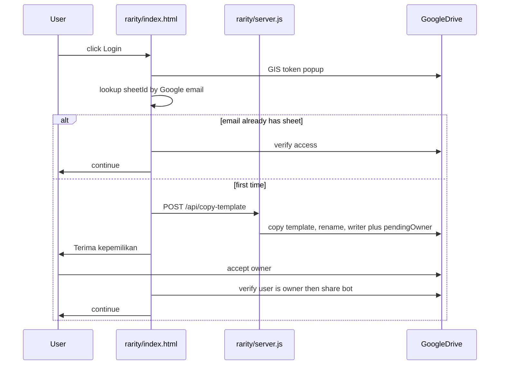

# Rarity sheet ownership + settings UI

Must-flow (no skip):

## Root cause of friend error

Error `The transferOwnership parameter must be enabled when the permission role is 'owner'` comes from `[rarity/server.js](rarity/server.js)` `permissions.update` with `transferOwnership: true` while body is still `role: writer`. Google treats that as an owner transfer missing a valid owner-role transfer.

Consumer Gmail cannot instant-transfer. Correct split:

- Owner (server): **one** `permissions.create` with `role: writer`, `pendingOwner: true`. **No** `transferOwnership`.
- User (frontend, after a click): `PATCH .../permissions/{id}?transferOwnership=true` body `{ role: "owner" }`.

Popup logs: expired token on load calls `triggerLogin('')` with **no click** (`[rarity/index.html](rarity/index.html)` ~2343). GIS popup blocked. Stay on login. User clicks again.

`Promised response from onMessage listener went out of scope` = browser extension. Ignore.

## 1. Sheet bound to Google account

Today: one `rarity_sheet_id`. Logout deletes it. Next login always copies. Wrong account can inherit leftover id.

- Store map `email -> { sheetId, permissionId, plannerTab }` in localStorage (`rarity_sheet_by_email`).
- After `fetchUserProfile`, set `spreadsheetId` from **that email** only. Never reuse another account's id.
- Logout: drop token/profile/chat. **Keep** email→sheet map.
- Server: `webSheets[email]` in a small file next to `users.json`. `POST /api/copy-template`: if email already has `sheetId`, return `{ id, existing: true }` (no second copy). On new copy, save mapping.
- Duplicate `reinitializeSheet` (~1353 and ~1387): keep **one** with confirm; clear **that email** only, then copy again.

## 2. Ownership accept is a required step

After copy (not `existing`):

- Do **not** auto-PATCH ownership inside `setupUserSheet`.
- Blocking UI: sheet name, Open Sheet, button **Terima kepemilikan**.
- Button (user gesture) runs the PATCH. Then `files.get?fields=owners` — user email must be owner. Fail → keep modal, show Drive invite / open sheet.
- Only then: `_ChatState`, share `rarity.erc@gmail.com` writer, continue.
- `sendNotificationEmail: true` on create so Drive invite exists if PATCH fails.

## 3. Chat loading + syntax fix

`[showBotTyping](rarity/index.html)` is called, **not defined**. Extra dead `return; }` after `pendingReceipt` (~1601–1602) kills all later chat.

- Add typing bubble (reuse `.chat-loader` spinner/dots as a bot msg).
- `showBotTyping(true/false)` around `callGemini` in `handleUserChat` (drop `addBotMsg("Memproses...")`) and `parseReceipt`.
- Delete the stray `return; }`.

## 4. Currency KRW + SAR

Same helper, both surfaces:

- Web `formatCurrency` / `#currency-select`: IDR, AUD, **KRW**, **SAR** (Saudi riyal).
- WA `[formatCurrency](rarity/server.js)` + `!currency` allow-list: `IDR|AUD|KRW|SAR`.

`Intl.NumberFormat`: KRW `ko-KR` 0 fraction; SAR `en-SA` 2 fraction.

## 5. Settings first page = WA, arrow = status/currency

`[#settings-modal](rarity/index.html)`: two panes, one chevron.

**Pane 1 (default):** WhatsApp Bot Sheet ID, Buka Chat, Salin, `!sheet <ID>`, Beri Izin Bot, Refresh, Buat Ulang Sheet. Short numbered guide: Salin ID → WA bot → `!sheet ID` → Beri Izin Bot → done.

**Pane 2 (arrow right):** Akun / Sheets / Gemini badges + Mata Uang select.

Widen modal a bit. Keep existing handlers (`copyWaSheetId`, `grantBotEditorAccess`, etc.).

## 6. Back buttons → SVG arrow

Replace `← Kembali...` text-arrow in `[privacy.html](rarity/privacy.html)`, `[terms.html](rarity/terms.html)`, `[about.html](rarity/about.html)`, `[versions/index.html](rarity/versions/index.html)`, `[status/index.html](rarity/status/index.html)`. Inline SVG chevron + same label. No new icon lib.

## Files

- `[rarity/index.html](rarity/index.html)` — login/sheet map, accept modal, typing, settings panes, currencies, drop auto-login, fix chat syntax, one `reinitializeSheet`
- `[rarity/server.js](rarity/server.js)` — pendingOwner-only share, email→sheet map, KRW/SAR
- five static pages — back SVG

Skipped: extension `onMessage` warning; Drive picker; new cloud DB (Render disk wipe = known ceiling; localStorage map still binds account on same browser).